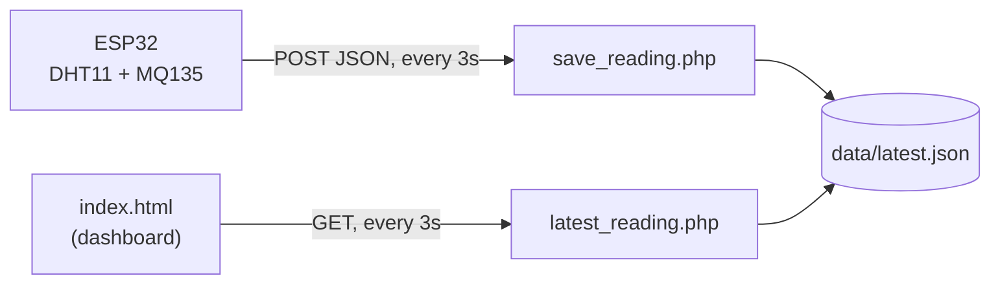

<div align="center">

# 🌡️ Ambient Monitor

**A live room-conditions dashboard for ESP32 — temperature, humidity, and air quality at a glance.**


</div>

---

Ambient Monitor turns a bare ESP32 + two cheap sensors into an instrument-panel-style
dashboard: three big gauges (room temperature, humidity, air quality), each with its
own live trend graph, each one flagging red the moment a reading drifts outside its
comfort range. No database, no framework — a single HTML file on the front end and a
two-endpoint file-backed API on the back.

## ✨ Features

- 🎛️ **Three live gauges** — big 270° dials with a colour scale that runs from
  green through amber to red across the full sensing range
- 📈 **Per-metric trend graphs** — last ~2 minutes of history, shaded to show the
  comfort band the reading is moving through
- 🚨 **Independent alerting** — each channel goes red on its own when it drifts out
  of range; a stuffy room with fine temperature only flags air quality, not all three
- 🔌 **Zero-dependency backend** — PHP writing a single JSON file, no MySQL required
- 📡 **Resilient firmware** — averages noisy MQ135 samples, falls back to the last
  good reading if the DHT11 misfires, and reconnects WiFi automatically

## 🖥️ Preview

<div align="center">
<em>Add a screenshot or screen recording of the dashboard here.</em>
</div>

## 🏗️ Architecture



The ESP32 never talks to the browser directly — it posts a reading, the dashboard
polls for the latest one. Either side can be offline without breaking the other.

## 📦 Project structure

```
ambient/
├── index.html              # Dashboard — gauges, trend graphs, live polling
├── README.md
├── LICENSE
├── .gitignore
├── api/
│   ├── save_reading.php    # POST endpoint — called by the ESP32
│   └── latest_reading.php  # GET endpoint — polled by the dashboard
├── data/
│   └── .gitkeep            # latest.json is written here at runtime
└── firmware/
    └── AmbientMonitor.ino  # ESP32 sketch
```

## 🧰 Tech stack

| Layer     | Tech                                              |
|-----------|----------------------------------------------------|
| Firmware  | ESP32 (Arduino core), DHT11, MQ135                 |
| Backend   | PHP — flat-file JSON store, no database            |
| Frontend  | Vanilla HTML/CSS/JS — hand-built SVG gauges & charts |
| Fonts     | [Inter](https://fonts.google.com/specimen/Inter), [JetBrains Mono](https://fonts.google.com/specimen/JetBrains+Mono) |

## 🚀 Getting started

### 1. Deploy the dashboard

```bash
# Copy the ambient/ folder into your web server's root, e.g.:
cp -r ambient /path/to/htdocs/ambient
chmod -R 775 ambient/data     # web server user needs write access here
```

Open `http://<your-server>/ambient/index.html` — it'll show **"waiting for
sensor…"** until the ESP32 sends its first reading.

### 2. Flash the firmware

Open `firmware/AmbientMonitor.ino` in the Arduino IDE (with ESP32 board support
installed) and set:

```cpp
const char* WIFI_SSID  = "YOUR_WIFI";
const char* WIFI_PASS  = "YOUR_PASSWORD";
const char* SERVER_URL = "http://YOUR_PC_IP/ambient/api/save_reading.php";
```

Then upload it to your ESP32. Open the Serial Monitor at `115200` baud to confirm
it's connecting and posting successfully.

<details>
<summary><strong>🔌 Wiring reference</strong></summary>

| Sensor | Pin  | ESP32 GPIO      | Notes                                   |
|--------|------|-----------------|------------------------------------------|
| DHT11  | DATA | `GPIO 5`        | Add a 10kΩ pull-up if your module lacks one |
| MQ135  | AOUT | `GPIO 34`       | Must be an ADC1 pin (32–39) — ADC2 conflicts with WiFi |

Both grounds tie to the ESP32's `GND`, both power pins to `3.3V`.

</details>

<details>
<summary><strong>🩹 Troubleshooting</strong></summary>

- **Dashboard stuck on "waiting for sensor…"** — check the Serial Monitor for a
  WiFi connect failure or `POST failed` line; confirm `SERVER_URL` still matches
  your PC's current LAN IP (it can change after a router reboot).
- **500 error when the ESP32 posts a reading** — `ambient/data/` isn't writable
  by the web server user; re-run the `chmod` above.
- **Air quality reads HIGH right after power-on** — normal. The MQ135 needs a
  couple of minutes to warm up before its readings settle.

</details>

## 🎯 Alert thresholds

| Metric            | Comfort range     | Sensor |
|-------------------|-------------------|--------|
| Room Temperature  | 18 – 28 °C         | DHT11  |
| Humidity          | 30 – 60 % RH       | DHT11  |
| Air Quality       | 0 – 350 PPM (raw)  | MQ135  |

Each gauge checks its own range independently — thresholds are configured per
channel in `index.html` and easy to retune to taste.

## 🗺️ Ideas for extending this

- [ ] Persist history to a small SQLite/MySQL table instead of a single JSON file, for day/week trend views
- [ ] Push notifications (email/Telegram) when a channel goes into alert
- [ ] Multi-room support — one dashboard, several ESP32 nodes
- [ ] CSV export of logged readings

## 📄 License

Licensed under the [MIT License](LICENSE) — free to use, modify, and share.
